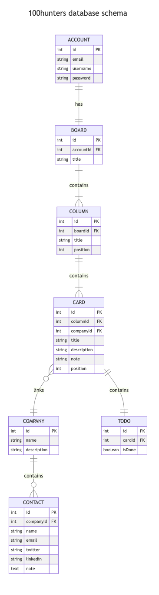

## Database
### Decision
To practice SQL queries, we decided to NOT use an ORM.

Using prepare statements only for saftey reasons, see [here](https://sidorares.github.io/node-mysql2/docs#using-prepared-statements)

### Schema
<picture>
  <source media="(prefers-color-scheme: dark)" srcset="../utils/mermaid/dark.png">
  
</picture>

### Documentation
Schema should be kept up to date using Mermaid Markdown in `utils/mermaid/schema.mmd`


```mmd
graph TD;
    A-->B;
    A-->C;
    B-->D;
    C-->D;
```


### Tools
`mysql2` :  
https://sidorares.github.io/node-mysql2/docs


`TypeScript + mysql2` :  
https://sidorares.github.io/node-mysql2/docs/examples/typescript/row-data/index